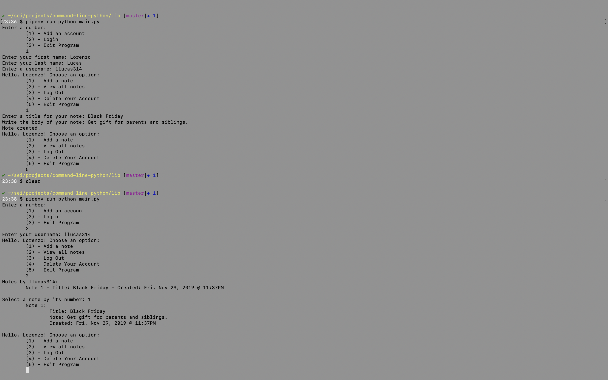
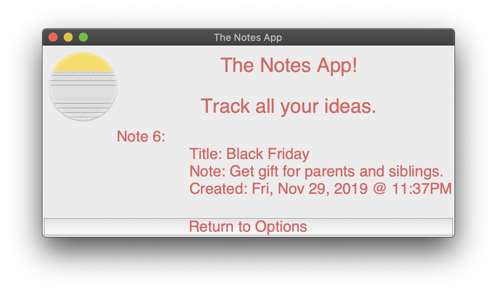

# command-line-python
This program is a note taking app that allows users to create and view their notes.

### Screenshots




### Built With

- Python/Tkinter
- SQL/Peewee/Postgres

### Installation

To run this application locally, you can also fork and clone this repository.

To install dependencies, navigate to the source directory and run this code in your terminal:

```
pipenv install

```

To start up the application, run this code in your terminal:

```
pipenv run python lib/main.py 

```

### Contributing

If you have any comments or suggestions please feel free to contact me through github.

### Future Additions

I would like to improve the front end to this application, and try using another GUI interface. Also I would like to increase CRUD capabilities.

### Final Thoughts

This was my first Python program and it was surprisingly easy to make the transition from Javascript. While the syntax was different, my approach to coding was very similar. I can't wait to explore more with Python.

### Author

- Lorenzo Lucas

